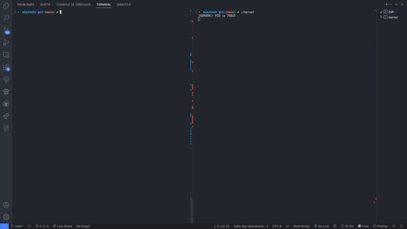
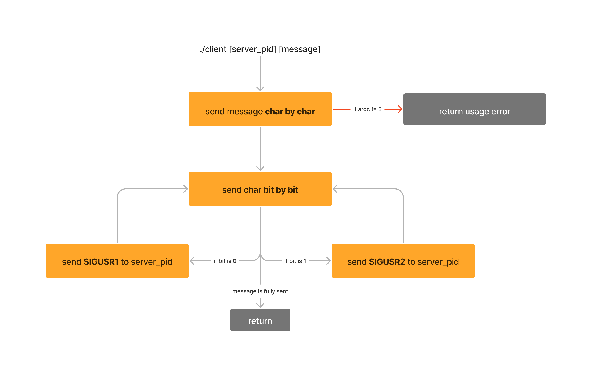
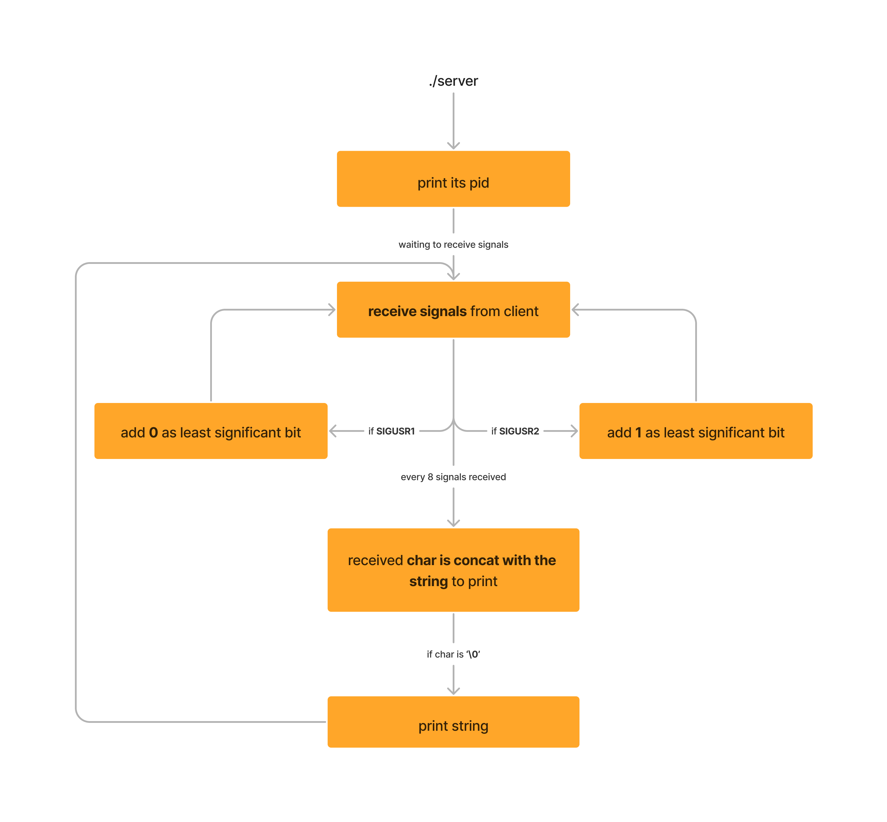

<div align="center">

# minitalk
#### Where is the description?
[](https://forthebadge.com)

</div>

Sixth project for [42 school](https://42.fr/en/homepage/). The aim is to create a client and a server that can communicate only using UNIX signals.
<div align="center">


</div>

## Subject

The communication between client and server has to be done only using SIGUSR1 and SIGUSR2 signals.

Server must:
- be started first 
- print its PID
- print the string after fully receiving
- be able to receive strings from several clients in a row without needing to restart.

## Usage

#### Server

```bash
./server
```

#### Client

```bash
./client [server_pid] [message]
```

## How does it work ?

#### Client



#### Server



## Useful links

[minitalk-Tester by @ThibaudM13](https://github.com/ThibaudM13/minitalk-Tester)  
[Cours "Gestion des Signaux" de Mr. Mandel à Polytech Paris-Sud](https://www.lri.fr/~mandel/systeme/systeme-06.pdf)
[GeeksforGeeks course](https://www.geeksforgeeks.org/signals-c-language/)
[code(quoi) article "Sending and intercepting a signal in C"](https://www.codequoi.com/en/sending-and-intercepting-a-signal-in-c/)